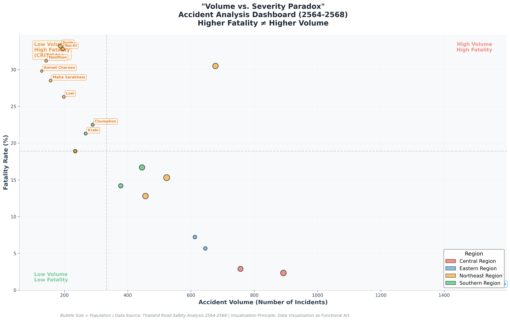

# Journey as an AI Storyteller
## From Data to Insight - My Evolution as an AI Student

---

# 🎯 หัวข้อที่ 1: Me as the main character
## *An AI student on a mission*

### 🌟 Do you know who i am?


---

# 🔄 หัวข้อที่ 2: My Application of Agile Frameworks
## *Agile Methodology*

ในโลกของ **Data** และ **AI** ข้อมูลมักจะมาพร้อมกับความไม่แน่นอน *(Uncertainty)* การวางแผนแบบดั้งเดิมที่ต้องรอให้ทุกอย่างสมบูรณ์แบบร้อยเปอร์เซ็นต์จึงไม่ตอบโจทย์ 

ฉันจึงเลือกใช้กรอบการทำงานแบบ **Agile Methodology** ที่เน้น:
- การทำซ้ำ *(Iterative)*
- การปรับตัว *(Adaptability)*
- การส่งมอบผลลัพธ์ที่ใช้งานได้จริงอย่างรวดเร็ว *(MVP - Minimum Viable Product)*

---

## 📋 ขั้นตอน 5 ขั้นของ Agile Framework

### **Step 1: Sprint Planning & Empathize** 
**_ตั้งเป้าหมายและทำความเข้าใจ_**

- **The Data:** ข้อมูลที่เลือกใช้ → **Open Data** ข้อมูลการเกิดอุบัติเหตุ
  - 🔗 [data.go.th/dataset/gdpublish-roadaccident](https://data.go.th/dataset/gdpublish-roadaccident)
- **The Goal:** 
  - *"ข้อมูลชุดนี้กำลังพยายามบอกอะไรเรา?"*
  - *"จะนำ Insight นี้ไปใช้ประโยชน์อย่างไร?"*

---

### **Step 2: AI as a Pair Analyst**
**_ใช้ GenAI ช่วยกำหนดทิศทาง_**

- นำข้อมูลให้ **GenAI** ช่วยวิเคราะห์เบื้องต้น
- **GenAI** ช่วยชี้เป้าหมายและแนะนำว่าควรระวังความผิดปกติตรงจุดไหน
- ทำให้สามารถวางแผนได้แม่นยำขึ้น

---

### **Step 3: Iterative Execution**
**_ทำแบบวนลูป_**

1. **Data Cleansing** ⚙️
   - การทำข้อมูลให้สะอาด
   - จัดการ Missing Values
   - Format ข้อมูลให้ถูกต้อง

2. **Visualization** 📊
   - เมื่อข้อมูลพร้อม เริ่มสร้าง MVP
   - ในโปรเจกต์นี้ = **"1-Chart Dashboard"**

---

### **Step 4: Feedback Loop & Integration**
**_เชื่อมโยงและปรับปรุง_**

- **เชื่อมโยงกับเพื่อน:**
  - ข้อมูลที่ดีไม่เพียงต้องสะอาด
  - ต้องปลอดภัยและสอดคล้องกับบริบทการใช้งานจริง

- **ปรับปรุงด้วยแนวคิดจาก eBook:**
  - นำแนวคิดจาก *Storytelling with Data*
  - กฎทองคำ: **_"Clutter is your enemy"_** *(ความรกคือศัตรู)*
  - ตัดแกนที่ไม่จำเป็น ลบเส้นตารางที่กวนสายตา
  - ให้ Insight โดดเด่นที่สุด

---

### **Step 5: The Final Delivery**
**_ส่งมอบผลลัพธ์_**

ผลลัพธ์สุดท้าย = **1-Chart Dashboard** ที่:
- ✅ ผ่านการคิดและขัดเกลามาอย่างถี่ถ้วน
- ✅ ใช้ GenAI เป็น Domain Expert ช่วยยืนยันความสมเหตุสมผล
- ✅ สอดคล้องกับหลักการจากคาบเรียน Day 2

---

# 🔍 หัวข้อที่ 3: Open Data ที่เลือก
## *The Accident Decoder Project*
### ถอดรหัสอุบัติเหตุทางถนนด้วย AI

---

## 📊 ข้อมูลหลัก

**Open Data สถิติอุบัติเหตุทางถนนของประเทศไทย** เป็นชุดข้อมูลที่มีความซับซ้อนสูง ประกอบไปด้วย:

- **เชิงพื้นที่** *(Spatial)*
- **เชิงเวลา** *(Temporal)*  
- **คุณลักษณะทางกายภาพ** *(Categorical Data)*

แทนที่จะใช้วิธีการสำรวจแบบดั้งเดิม ฉันได้ **บูรณาการการทำงานร่วมกับ Generative AI** เพื่อ:
- 🚀 เร่งกระบวนการค้นหา Insight
- 🎯 มีประสิทธิภาพและเจาะลึกมากยิ่งขึ้น

---

## 🤖 บทบาทของ GenAI

### _AI as an Analytical Catalyst_

ประยุกต์ใช้เทคนิค **Prompt Engineering** โดยส่ง:
- Data Dictionary
- โครงสร้างทางสถิติของชุดข้อมูล *(Statistical Summary)*

**ให้ GenAI ทำการวิเคราะห์เบื้องต้น** ซึ่งเปรียบเสมือนการมี:
- ผู้เชี่ยวชาญด้านข้อมูล *(Domain Expert)*
- คอยช่วยตั้งสมมติฐาน
- ชี้ให้เห็นความผิดปกติ *(Data Anomalies)*
- แสดงความสัมพันธ์เชิงตัวแปร *(Feature Correlations)*

---

## 🎨 ข้อค้นพบเชิงลึก
### Key Insights Discovered

---

### **Insight 1: The Volume vs. Severity Paradox**
#### ปริมาณรถติด ไม่ได้น่ากลัวเท่า "ถนนโล่ง"


**ข้อค้นพบหลัก:**
- คนทั่วไปคิดว่า กทม. มีคนตายเยอะเพราะอุบัติเหตุเกิดบ่อย
- **ความจริง:** _"ยิ่งถนนโล่ง ยิ่งอันตรายถึงชีวิต"_

**ตัวเลขพูดได้:**

| | ปริมาณ | อัตราเสียชีวิต |
|------|---------|------------|
| **กรุงเทพฯ** | 1,528 ครั้ง (สูงสุด) | 1.57% **(ต่ำสุด)** |
| **จังหวัดห่างไกล** | น้อยกว่า 10 เท่า | 33-35% **(สูงสุด)** |

**การปรับงบประมาณ:**
1. ลดงบโฆษณาในเมืองหลวง
2. ติดตั้งอุปกรณ์ลดความเร็ว *(Rumble Strips)*
3. ไฟส่องสว่างในทางหลวงชนบท
4. ย้ายกล้องตรวจจับความเร็ว

---

### **Insight 2: The Midnight Lethality**
#### ช่วงเวลาแห่งความตาย


**ข้อค้นพบหลัก:**

| ช่วงเวลา | ปริมาณ | อัตราตาย |
|----------|--------|---------|
| **14:00-16:00 น.** | 📊 พีค | ต่ำ |
| **00:00-06:00 น.** | ต่ำ | 📈 พีค (24.4%) |
| **22:00-05:00 น.** | ปกติ | ⚠️ **สูงสุด** |

**สาเหตุที่แตกต่าง:**
- ช่วงบ่าย: ความเร่งรีบ + รถติด = รุนแรงต่ำ
- ช่วงกลางคืน: ทัศนวิสัย ↓ + เหล้า + หลับใน = **รุนแรงสูง**

**การปรับงบประมาณ:**
1. จัดสรรกำลังคน → **ช่วง 00:00-06:00 น. มากขึ้น**
2. Smart Lighting → ไฟอัจฉริยะบนถนนเสี่ยง

---

### **Insight 3: The Vehicle Size Discrepancy**
#### อุบัติเหตุต่อการเสียชีวิตของประเภทยานพาหนะ


**สถิติบอกเรา:**
- "กระบะ" + "รถเก๋ง" ชนบ่อยสุด (~2 หมื่นครั้ง)

**แต่ความจริง:**
- **ผู้รับเคราะห์แท้:** มอเตอร์ไซค์ + สามล้อเครื่อง (อัตราตาย 36-46%)
- **ผู้สร้าง Damage หนัก:** รถบรรทุก + รถตู้ (อัตราตาย >20%)

**การปรับงบประมาณ:**
1. **Segregation:** เลนเฉพาะสำหรับรถจักรยานยนต์
2. **Telematics:** บังคับใช้ในรถบรรทุก + Blind Spot Detection

---

### **Insight 4: The Holiday Illusion**
#### อย่าใส่ใจแค่ช่วงเทศกาล


**ข้อค้นพบที่น่าแปลก:**

| | อุบัติเหตุ | อัตราตาย |
|------|---------|---------|
| **เม.ย. / ธ.ค. (เทศกาล)** | สูง | ปกติ |
| **ตุลา-พฤศจิกายน (ปกติ)** | ปกติ | **สูงกว่า!** 📈 |

**ทำไม?** เพราะเทศกาล = รถติด = ขับช้า = ลดเสียชีวิต

**การปรับงบประมาณ:**
1. **Always-on Campaign:** ไม่ใช่เพียงเทศกาล ตลอดทั้งปี
2. **Dynamic Insurance Pricing:** ปรับเบี้ยตามความเสี่ยงจริง

---

# 🔗 หัวข้อที่ 4: การเชื่อมโยง Live Lab
## *ความเกี่ยวข้องกับโปรเจกต์ Accident Decoder*

---

## 📚 Lab ที่ใช้: 2 บทเรียน

### **Lab 05.1.4: Prepare Data in Different File Formats**

**เนื้อหา:**
- CSV, Excel, JSON
- Data Cleansing
- Missing Values

**ประยุกต์ใช้ในโปรเจกต์:**
- ✅ จัดการข้อมูลดิบ (Raw Data)
- ✅ ปรับชื่อจังหวัดให้เป็นมาตรฐาน
- ✅ แก้ไข Missing Values

---

### **Lab 01.2.7: Navigate Database Design**

**เนื้อหา:**
- โครงสร้างฐานข้อมูล
- Relational Database
- ลดความซ้ำซ้อน

**ประยุกต์ใช้ในโปรเจกต์:**
- ✅ แบ่งข้อมูลเป็น 3 ส่วน:
  1. ข้อมูลเหตุการณ์
  2. ข้อมูลบุคคล
  3. ข้อมูลพาหนะ
- ✅ เชื่อมด้วย "รหัสอุบัติเหตุ"

---

## 🏠 เปรียบเทียบเป็นการสร้างบ้าน

```
Lab 05.1.4 (Prepare Data)
    ↓
 = เตรียมอิฐ หิน ปูน ทราย ให้สะอาด

Lab 01.2.7 (Database Design)
    ↓
 = วางแบบแปลนบ้าน จัดโครงสร้าง

Accident Decoder (Project)
    ↓
 = ตัวบ้านเสร็จสิ้น → ตกแต่งเป็น Dashboard
```

---

# 🎯 หัวข้อที่ 5: การบูรณาการข้อมูล
## *ผลจากการวิเคราะห์ข้อมูลปี 2564–2568*

---

## 🔄 การเชื่อมโยงระหว่าง 2 งานวิจัย

**Accident Decoder (2019)** + **เพื่อน (2564-2568)**
= ความสัมพันธ์ **5 ระดับ**

---

### **♦ ระดับที่ 1: เวลาคือเมื่อใด**

**Insight ของเพื่อน:** 19:00 น. = ชั่วโมงมรณะ

| Insight | ค่า |
|---------|-----|
| ช่วงเวลา | 18:00-21:00 น. |
| เสียชีวิต | 750 ราย @ 19:00 น. |

**การเชื่อมโยง:**
- Accident Decoder → ค้นพบ "Micro-sleep" ในหลายช่วงเวลา
- ข้อมูล 2564-2568 → **ชี้ให้ชัดเจน ว่า 18:00-21:00 สูงสุด**
- **ความเหนื่อยล้า (Fatigue)** เพิ่มขึ้นเมื่อแสงลดลง

---

### **♦ ระดับที่ 2: เทศกาล ≠ ศัตรู**

**Insight ของเพื่อน:** มกราคม = อันตรายสุด (1,634 ราย)

**การเชื่อมโยง:**
- **เทศกาลปีใหม่** (สงกรานต์ + ปีใหม่สากล) = **ศักยภาพสูง**
- เนื่องจาก:
  - ความหนาแน่นเดินทาง ↑
  - จิตสำนึกความปลอดภัย ↓
  - ต้อง **รีบปรับมาตรการ _ก่อน_ เข้าเดือนมกราคม**

---

### **♦ ระดับที่ 3: เพศชาย = กลุ่มเสี่ยง**

**Insight ของเพื่อน:** ผู้ชาย เสียชีวิต **3 เท่า** ของผู้หญิง

**พฤติกรรม:**
- ❌ ไม่สวมหมวกกันน็อค
- ❌ ขับเร็ว
- ❌ ดื่มแล้วขับ

**การเชื่อมโยง:**
- นี่คือ **ลักษณะเฉพาะของเพศชาย**
- **แคมเปญต้องมี Target ชัดเจน: "ผู้ชาย"** ≠ ประชาชนทั่วไป

---

### **♦ ระดับที่ 4: ผู้สูงอายุ = ปัญหาโครงสร้าง**

**Insight ของเพื่อน:** ผู้สูงอายุ 65+ เสียชีวิตมากสุด

**สาเหตุ:**
- ร่างกายฟื้นตัวช้า
- **พึ่งรถจักรยานยนต์** (ขาดขนส่งสาธารณะในชนบท)

**การเชื่อมโยง:**
- นี่ไม่ใช่เพียง **ปัญหาสรีรวิทยา**
- เป็น **ปัญหาโครงสร้างสังคม** ← ต้องแก้นโยบายยาว

---

### **♦ ระดับที่ 5: รถจักรยานยนต์ = แกนกลาง**

**Insight ของเพื่อน:** 79% ของยานพาหนะ (ระบุได้)

**+** ข้อมูล "ไม่ระบุพาหนะ" = 33,583 ราย

**→ รวมกัน อาจเกิน 85-88%**

**การเชื่อมโยง:**
- นี่คือปัญหา **"โครงสร้าง"** ของรถจักรยานยนต์เอง
- ไม่ใช่เทคโนโลยี

---

## 🎯 ระดับที่ 6: สูตรแห่งความตาย

```
ผู้เสียชีวิต = 
  (เพศชาย + ผู้สูงอายุ) 
  × (รถจักรยานยนต์) 
  × (เวลา 18:00-21:00) 
  × (เดือน มกราคม-ธันวาคม)
```

**ข้อสรุปนโยบาย 3 ระดับ:**

1. **เป้าหมายแรก:** ผู้ชาย 65+ บนรถจักรยานยนต์ เวลา 18:00-21:00
2. **เป้าหมายที่สอง:** Smart Lighting บนทางหลวงชนบท
3. **เป้าหมายที่สาม:** มาตรการเชิงรุก **_ก่อน_** เข้าเดือนมกราคม

---

# 🎨 หัวข้อที่ 6: ศิลปะของภาพนิทัศน์
## *Data Visualization as Functional Art*

**หนังสือ:** ผศ.ดร.อานนท์ ศักดิ์วรวิชญ์  
**หลักการ:** 5.2 มุมมองเชิงศิลปะของการออกแบบภาพนิทัศน์

---

## 4 หลักการสำคัญ

### **1️⃣ ข้อมูลต้องเด่นชัด (Salience)**

- **Figure** = ข้อมูล (โดดเด่น)
- **Ground** = พื้นหลัง (อ่อนลง)
- ใช้ **สี + เส้น + จุด** อย่างชาญฉลาด

**ในชาร์ต:**
- จุดข้อมูล = **สีสดใจตามภูมิภาค**
- กริด = **สีอ่อนมาก**
- เส้น reference = **เส้นประสีหรี่**

---

### **2️⃣ การเปรียบเทียบสายตา (Eyespan)**

**ทฤษฎี Stevens' Psychophysics:**
- ระดับการรับรู้ = **Power Law** ($y = L \cdot S^n$)
- ข้อมูลต้องอยู่ **ในหน้าจอเดียวกัน**

**ในชาร์ต:**
- **4 Quadrants** มองในทันที:
  - ✓ ขวาบน = High Volume + High Fatality
  - ✓ ขวาล่าง = High Volume + Low Fatality  
  - ✓ ซ้ายบน = Low Volume + High Fatality ⚠️
  - ✓ ซ้ายล่าง = Low Volume + Low Fatality

---

### **3️⃣ ใช้สี/เส้น/ทรง (Emphasis)**

**ตัวอย่างจากหนังสือ:**
- ภาคใต้ = **สีแดง**
- ภาคอื่น = **สีเทา** → โดดเด่นกว่า!

**ในชาร์ต:**
- Scatter Plot > Bar Chart (สีมีเลขยกกำลังสูง)
- Bubble Size = ประชากร (ตัวแปรที่ 3)
- Position = ความสัมพันธ์ 2 แกน

---

### **4️⃣ Spotlighting (เน้นจุดสำคัญ)**

**เมื่อต้องเจาะลึก:**
- ไฮไลต์จังหวัดเสี่ยง (สีแดงสดใจ)
- จังหวัดอื่น → สีเทา

---

## 💡 หลักการแก่นสาร

> **"หัวใจการออกแบบที่ดี ≠ ความสวยงาม"**  
> **"แต่ Clarity (ความชัดเจน) + Truthfulness (ความสัตย์)"**

**Dashboard ของฉัน:**
1. ✅ ลบความรก (Clutter Removal)
2. ✅ ข้อมูลเด่น (Data Prominence)
3. ✅ เปรียบเทียบได้ (Visual Comparison)
4. ✅ เรื่องราวผ่านรูป (Narrative through Visuals)

---

# 📊 หัวข้อที่ 7: Dashboard สุดท้าย
## *"Volume vs. Fatality" Scatter Plot*

---



---

## 3 คำถามที่ Dashboard ตอบ

### **1️⃣ ทำไมเลือก Scatter Plot?**

| องค์ประกอบ | ฟิลด์ | ประเภท | ความหมาย |
|-----------|------|-------|---------|
| **X-Axis** | `accident_count` | ตัวเลข | ปริมาณ/ความถี่ |
| **Y-Axis** | `fatality_rate_%` | ตัวเลข | ความรุนแรง |
| **Bubble** | `population` | ตัวเลข | บริบท/ขนาด |
| **Color** | `region` | หมวดหมู่ | Clustering |
| **Label** | `province_name` | ข้อความ | ตัวตน |

**เหตุผล:**
- ทลายความเชื่อ: "_อุบัติเหตุเยอะ ≠ อันตรายต่อชีวิตมาก_"

---

### **2️⃣ Data Mapping มีความหมายอย่างไร?**

**X → Accident Count**
- แสดงว่า "ขนาด" ของปัญหา

**Y → Fatality Rate**  
- แสดงว่า "ความรุนแรง" ของปัญหา

**Bubble Size → Population**
- จังหวัดเล็กแต่อัตราส่วนต่อหัวสูง

**Color → Region**
- เห็น Cluster ของพื้นที่

---

### **3️⃣ Dashboard ตอบคำถาม 3 ข้อ**

#### ❌ **ข้อเชื่อเก่า:**
```
"กรุงเทพฯ มีอุบัติเหตุพีค 
 → ต้องให้งบประมาณกรุงเทพฯมากที่สุด"
```

#### ✅ **Insight สดใจ:**
```
"กรุงเทพฯ = ขวาล่าง (High Volume + Low Fatality)
 → ให้งบ Awareness/Management เท่านั้น

จังหวัดห่างไกล = ซ้ายบน (Low Volume + High Fatality) ⚠️
 → ให้งบ Life-Saving Intervention เป็นลำดับแรก"
```

---

## 4 ส่วนของ Quadrant

| | ตำแหน่ง | ความหมาย | ตัวอย่าง | การตัดสินใจ |
|---|---------|---------|---------|-----------|
| **ขวาบน** | H.Vol + H.Fatal | ปัญหา BIG & HARD | -(ไม่มี) | ติดตาม |
| **ขวาล่าง** | H.Vol + L.Fatal | ปัญหา BIG & SOFT | กรุงเทพฯ | Awareness |
| **ซ้ายบน** | L.Vol + H.Fatal | ปัญหา SMALL & HARD ⚠️ | สุรินทร์ | **จัดสรรงบ!** |
| **ซ้ายล่าง** | L.Vol + L.Fatal | ปัญหา SMALL & SOFT | เชียงใหม่ | Monitor |

---

## 🚀 นำมาใช้จริง

### **ระดับที่ 1: จัดสรรงบประมาณ**

```
จังหวัดซ้ายบน  → 50% (Life-Saving)
จังหวัดขวาล่าง → 30% (Awareness)
จังหวัดซ้ายล่าง → 20% (Monitor)
```

### **ระดับที่ 2: Policy Priority**

- 📍 **Speed Cameras** → ซ้ายบน
- 💡 **Smart Lighting** → Northeast
- 👴 **Elderly Programs** → ผู้สูงอายุ + รถจักรยานยนต์

### **ระดับที่ 3: ประเมิน ROI**

```
กรุงเทพฯ (ขวาล่าง):
  Cost/Life = สูง → ROI ต่ำ

สุรินทร์ (ซ้ายบน):
  Cost/Life = ต่ำ → ROI สูง ✓
```

---

## ✨ บทสรุป: จากข้อมูลสู่การปฏิบัติ

### 🎯 **ข้อเชื่อเก่า vs. ความจริงใหม่**

| | เดิม | ใหม่ |
|---|------|------|
| **รถติด** | ต้องให้งบมากที่สุด | ไม่จำเป็นต้องเพิ่มมาก |
| **ถนนโล่ง** | ปลอดภัย (ผิด!) | **อันตรายต่อชีวิตสุด** |
| **เทศกาล** | เป็นศัตรู | เป็นปัจจัยเสริม |
| **ผู้สูงอายุ** | ต้องการจิตสำนึก | ต้องการ Life-Saving Infrastructure |

---

### 💪 **Dashboard มีอำนาจ:**

1. ✅ **ลบความรก** ไม่มีสีฟุ้งเฟ้อ
2. ✅ **ข้อมูลโดดเด่น** ชัดเจนทันที
3. ✅ **เปรียบเทียบได้** ในมุมมองเดียว
4. ✅ **Actionable** นำไปปฏิบัติได้จริง

---

### 🏆 **MVP (Minimum Viable Product)**

**เพียงชาร์ตเดียว แต่:**
- 📊 บ่งบอกข้อมูลครบถ้วน
- 🎯 ตอบคำถามทั้งหมด
- 💡 ทลายความเชื่อเดิม
- ⚡ นำไปตัดสินใจได้ทันที

---

## 📚 เอกสารอ้างอิง

- 📌 **Data Source:** 
  - Open Data: Data.go.th - Road Accident Statistics
  - Friend's Analysis (2564-2568)
  - Accident Decoder Project (2562)

- 🔧 **Methodology:**
  - Agile Methodology + GenAI Analysis

- 🎨 **Visualization Principle:**
  - *"Data Visualization as Functional Art"* ผศ.ดร.อานนท์ ศักดิ์วรวิชญ์

- 📖 **Design Philosophy:**
  - Tufte, E.R. (2001) - *"Envisioning Information"*

---

# 🎓 ข้อสรุป

**"ข้อมูลนั้นไม่ได้อยู่เพื่อบอกเรื่อง แต่เพื่อเปลี่ยนแปลงการกระทำ"**

บทความนี้คือการเดินทางจาก **"ผู้เรียน"** ไปสู่ **"ผู้ตัดสินใจที่มีหลักฐาน"** 🚀

---

**_The End_** ✨
