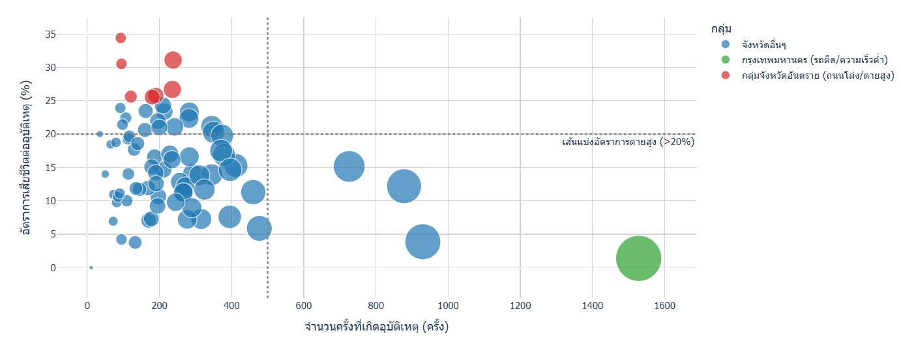
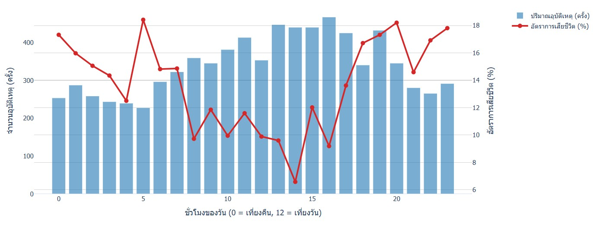
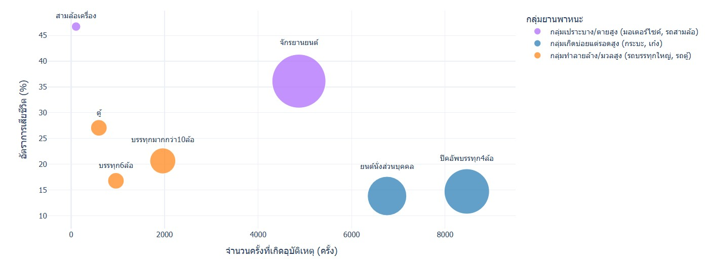
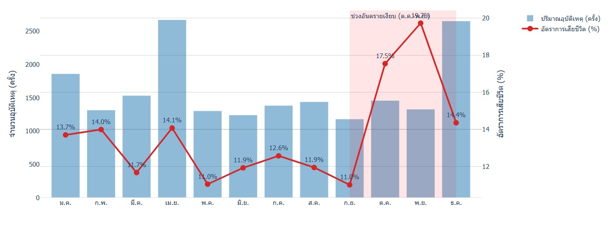

### 🌟Do you know who i am ?###

## ⚙️ The Blueprint: ขับเคลื่อนโปรเจกต์ด้วย Agile Methodology

ในโลกของ Data และ AI ข้อมูลมักจะมาพร้อมกับความไม่แน่นอน (Uncertainty) การวางแผนแบบดั้งเดิมที่ต้องรอให้ทุกอย่างสมบูรณ์แบบร้อยเปอร์เซ็นต์จึงไม่ตอบโจทย์ ฉันจึงเลือกใช้กรอบการทำงานแบบ **Agile Methodology** ที่เน้นการทำซ้ำ (Iterative) การปรับตัว (Adaptability) และการส่งมอบผลลัพธ์ที่ใช้งานได้จริงอย่างรวดเร็ว (MVP - Minimum Viable Product)

### Step 1: Sprint Planning & Empathize (ตั้งเป้าหมายและทำความเข้าใจ)
* **The Data:** ข้อมูลที่เลือกใช้ **Open Data** ข้อมูลการเกิดอุบัติเหตุ [https://data.go.th/dataset/gdpublish-roadaccident] 
* **The Goal:**  *"ข้อมูลชุดนี้กำลังพยายามบอกอะไรเรา?"* และ *"จะนำ Insight นี้ไปใช้ประโยชน์อย่างไร?"*

### Step 2: AI as a Pair Analyst (ใช้ GenAI ช่วยกำหนดทิศทาง)
* นำData ให้ **GenAI** ช่วยวิเคราะห์เบื้องต้น 
* GenAI ช่วยชี้เป้าหมายและแนะนำว่าควรระวังความผิดปกติ ตรงจุดไหน ทำให้สามารถวางแผนได้แม่นยำขึ้น

### Step 3: Iterative Execution (ทำแบบวนลูป)
1. **Data Cleansing :** การทำข้อมูลให้สะอาด จัดการ Missing Values และ Format ข้อมูลให้ถูกต้อง
2. **Visualization :** เมื่อข้อมูลพร้อม เริ่มสร้าง MVP ซึ่งในโปรเจกต์นี้ก็คือ **"1-Chart Dashboard"**

### Step 4: Feedback Loop & Integration
* **เชื่อมโยงกับเพื่อน:** เชื่อมโยงกับบทความของเพื่อนที่เขียนเกี่ยวกับ [ระบุชื่อหัวข้อของเพื่อน เช่น Data Privacy & AI Ethics หรือ มุมมองทางธุรกิจ] ทำให้เห็นภาพรวมว่า ข้อมูลที่ดีไม่เพียงต้องสะอาด แต่ต้องปลอดภัยและสอดคล้องกับบริบทการใช้งานจริง
* **ปรับปรุงด้วยแนวคิดจาก eBook:** ฉันนำแนวคิดจาก eBook เล่มโปรด (เช่น *Storytelling with Data*) ที่มีกฎทองคำว่า **"Clutter is your enemy"** (ความรกคือศัตรู) มาใช้ทบทวนชาร์ตของตัวเอง ตัดแกนที่ไม่จำเป็น ลบเส้นตารางที่กวนสายตา เพื่อให้ Insight โดดเด่นที่สุด

### Step 5: The Final Delivery (ส่งมอบผลลัพธ์)
ผลลัพธ์สุดท้ายจากการใช้ Agile คือ 1-Chart Dashboard ที่ผ่านการคิดและขัดเกลามาอย่างถี่ถ้วน โดยใช้ GenAI เป็น Domain Expert ช่วยยืนยันความสมเหตุสมผลของการจับคู่ข้อมูล (Data Mapping)

---

## The Accident Decoder Project (ถอดรหัสอุบัติเหตุทางถนนด้วย AI)

 **Open Data สถิติอุบัติเหตุทางถนนของประเทศไทย** เป็นชุดข้อมูลที่มีความซับซ้อนสูง ประกอบไปด้วยตัวแปรทั้งเชิงพื้นที่ (Spatial), เชิงเวลา (Temporal) และคุณลักษณะทางกายภาพ (Categorical Data)

แทนที่จะใช้วิธีการสำรวจข้อมูลเบื้องต้น แบบดั้งเดิมที่ใช้เวลานาน ได้บูรณาการการทำงานร่วมกับ **Generative AI** เพื่อเร่งกระบวนการค้นหา Insight ให้มีประสิทธิภาพและเจาะลึกมากยิ่งขึ้น

### บทบาทของ GenAI ในกระบวนการวิเคราะห์ (AI as an Analytical Catalyst)
 ประยุกต์ใช้เทคนิค Prompt Engineering โดยส่ง Data Dictionary และโครงสร้างทางสถิติของชุดข้อมูล (Statistical Summary) ให้ GenAI ทำการวิเคราะห์เบื้องต้น การทำงานร่วมกับ AI ในขั้นตอนนี้เปรียบเสมือนการมีผู้เชี่ยวชาญด้านข้อมูล (Domain Expert) คอยช่วยตั้งสมมติฐาน ซึ่ง GenAI ได้ชี้ให้เห็นถึงความผิดปกติของข้อมูล (Data Anomalies) และความสัมพันธ์เชิงตัวแปร (Feature Correlations) ที่นำไปสู่ข้อค้นพบที่สำคัญ ดังนี้:

### ข้อค้นพบเชิงลึก (Key Insights Discovered)

### Insight 1: The Volume vs. Severity Paradox 
####  ปริมาณรถติด ไม่ได้น่ากลัวเท่า "ถนนโล่ง"
คนทั่วไปมักคิดว่า กทม. หรือถนนเส้นหลักที่รถติดๆ จะมีคนตายเยอะเพราะอุบัติเหตุเกิดบ่อย แต่ความจริงคือ **"ยิ่งถนนโล่ง ยิ่งอันตรายถึงชีวิต"** แม้ กทม. จะมียอดการชนสูงลิ่ว แต่ความรุนแรงกลับต่ำ (แค่รถบุบ บาดเจ็บเล็กน้อย) ในขณะที่ "ถนนทางหลวงชนบท" หรือในต่างจังหวัดที่รถน้อย ถนนโล่ง กลับมีเคส "เสียชีวิตทันที" โผล่มาเป็นจำนวนมาก
* ** การค้นพบ:** จังหวัดที่มีอุบัติเหตุบ่อยที่สุด (เช่น กรุงเทพมหานคร - 1,528 ครั้ง) กลับมีอัตราการเสียชีวิตต่ำที่สุด (1.57%) ในขณะที่จังหวัดในพื้นที่ห่างไกล (เช่น สุรินทร์, ร้อยเอ็ด) มียอดอุบัติเหตุน้อยกว่าเกือบ 10 เท่า แต่มีอัตราการเสียชีวิตสูงกว่า 20 เท่า (33-35%)
* ** การปรับงบประมาณ:**
    * ลดการทุ่มงบโฆษณารณรงค์ในเมืองหลวง แล้วนำไปติดตั้งอุปกรณ์ลดความเร็ว (เช่น ลูกระนาดสั่นสะเทือน Rumble Strips) และไฟส่องสว่างในถนนสายรองหรือทางหลวงชนบทแทน
    * ย้ายกล้องตรวจจับความเร็วไปไว้ตามถนนต่างจังหวัดที่เป็นทางตรงยาวและโล่ง

### Insight 2: The Midnight Lethality 
####  ช่วงเวลาแห่งความตาย
หากดูแค่ "ปริมาณ" ช่วงเวลา 14.00-16.00 น. คือช่วงที่อุบัติเหตุพีคที่สุด เราอาจคิดว่านี่คือช่วงอันตราย แต่เมื่อเจาะลึกไปที่ความรุนแรง ช่วงเวลา 00:00 - 06:00 น. กลับมีสัดส่วนการตายและอุบัติเหตุรุนแรงสูงอย่างมีนัยสำคัญ
* ** การค้นพบ:** ปริมาณอุบัติเหตุพีคที่สุดช่วง 14:00 - 16:00 น. แต่อัตราการเสียชีวิตพุ่งสูงสุดในช่วง 22:00 - 05:00 น. (แตะระดับ 24.4%) อุบัติเหตุช่วงบ่ายมักเกิดจากความเร่งรีบและรถติด (รุนแรงต่ำ) แต่อุบัติเหตุช่วงกลางคืนเกิดจากทัศนวิสัยต่ำ การดื่มสุรา และการหลับใน (รุนแรงสูงมาก)
* ** การปรับงบประมาณ:**
    * จัดสรรกำลังคนใหม่: ปกติหน่วยกู้ภัยและตำรวจมักตั้งด่านหรือสแตนด์บายหนาแน่นช่วงกลางวัน/หัวค่ำ ควรปรับตารางเวรให้มีทีมพร้อมตอบสนองฉุกเฉิน ในช่วง 00:00 - 06:00 น. มากขึ้น
    * Smart Lighting: ลงทุนระบบไฟถนนอัจฉริยะที่จะสว่างขึ้นเมื่อมีรถวิ่งผ่านในเส้นทางเสี่ยงช่วงหลังเที่ยงคืน

### Insight 3: The Vehicle Size Discrepancy 
####  อุบัติเหตุต่อการเสียชีวิตของประเภทยานพาหนะ
สถิติบอกว่า "กระบะ" และ "รถเก๋ง" ชนบ่อยที่สุด (เกือบ 2 หมื่นครั้งรวมกัน) ทำให้สังคมมักเพ่งเล็งไปที่รถสองประเภทนี้ แต่ผู้รับเคราะห์ตัวจริงที่โดน Damage หนักที่สุดคือ "มอเตอร์ไซค์" (เจ็บหนัก/ตาย) และผู้สร้าง Damage ที่น่ากลัวที่สุดคือ "รถบรรทุก" (เกิดน้อย แต่ชนทีไรพังพินาศ)
* ** การค้นพบ:** รถปิคอัพและรถเก๋งมีสถิติการชนสูงสุด แต่ผู้รับเคราะห์ที่แท้จริงคือ รถจักรยานยนต์และรถสามล้อเครื่อง (อัตราตาย 36-46%) ขณะที่รถบรรทุกขนาดใหญ่และรถตู้โดยสารสร้างความรุนแรงระดับ High-Impact (อัตราตาย >20%) การบริหารจัดการถนนต้องมุ่งเน้นการแยกกลุ่มรถเป้าหมายที่ต่างกันออกจากกัน
* ** การปรับงบประมาณ:**
    * การแบ่งแยกพื้นที่ถนน (Segregation): เสนอให้มีเลนเฉพาะสำหรับรถจักรยานยนต์ (Motorcycle Lane) ในเส้นทางหลัก เพื่อแยกกลุ่มเปราะบางออกจากกลุ่มรถ 4 ล้อขึ้นไป
    * เทคโนโลยีคุมรถใหญ่: บริษัทขนส่ง/ภาครัฐ ต้องบังคับใช้ระบบ Telematics และเซ็นเซอร์เตือนจุดบอด (Blind Spot Detection) สำหรับรถบรรทุกทุกคัน เพื่อลด High Impact Case

### Insight 4: The Holiday Illusion 
####  อย่าใส่ใจแค่ช่วงเทศกาล
แม้ เม.ย. และ ธ.ค. จะมียอดอุบัติเหตุสูง แต่ถ้าเราเอาบริบทของปริมาณรถในช่วงเทศกาลมาหาร (อัตราส่วนการชนต่อจำนวนรถที่เดินทาง) เราจะพบว่าจริงๆ แล้ว ช่วงนอกเทศกาลต่างหาก ที่คนมีความเสี่ยงในการเสียชีวิตสูงกว่า! เพราะเทศกาลรถติดจนขับเร็วไม่ได้
* ** การค้นพบ:** อัตราการเสียชีวิตในเดือน "ตุลาคม-พฤศจิกายน" สูงกว่าช่วงเทศกาลสงกรานต์และปีใหม่ แคมเปญรณรงค์ระดับประเทศที่มุ่งเน้นเฉพาะช่วงเทศกาล อาจทำให้ประชาชนละเลยความเสี่ยงในช่วง "วันธรรมดาที่ถนนโล่ง" ซึ่งมีความเสี่ยงต่อการเสียชีวิตสูงกว่า
* ** การปรับงบประมาณ:**
    * Always-on Campaign: เลิกใช้งบ PR แบบทุ่มตู้มเดียวช่วงเทศกาล แต่ให้กระจายงบทำแคมเปญสร้างจิตสำนึกตลอดทั้งปี (Year-round safety communication)
    * Dynamic Insurance Pricing: สำหรับธุรกิจประกันภัย สามารถนำ Insight นี้ไปปรับเบี้ยประกันให้สะท้อนความเสี่ยงที่แท้จริง ไม่ใช่แค่จับตาดูช่วงเทศกาลอย่างเดียว

---

## 🌓 วิวัฒนาการและจุดเชื่อมโยง (Key Linkages)

การบูรณาการข้อมูลระหว่างสองงานวิจัย ทำให้เราค้นพบความสัมพันธ์ที่สำคัญ 3 มิติ:

### 1. ความเร็วคือฆาตกรที่คงเส้นคงวา (Speed as a Constant)
* **Accident Decoder (2019):** ระบุว่าความเร็วในเส้นทางตรง (จังหวัดทางผ่าน) มี Fatality Rate สูงกว่าความหนาแน่นในเมือง
* **2025 Analysis:** ยืนยันด้วยข้อมูลจริงที่ "นครราชสีมา" มีผู้เสียชีวิตอันดับ 1 (677 ราย) สูงกว่ากรุงเทพฯ แม้มีปริมาณรถสะสมน้อยกว่า
* **Insight:** ยืนยันว่ามาตรการควบคุมความเร็วในจังหวัดทางผ่านมีความสำคัญเร่งด่วนกว่าการจัดการจราจรติดขัดในแง่ของการรักษาชีวิต

### 2. ปัจจัยทางสรีรวิทยาและกลุ่มเป้าหมาย (The Vulnerable Groups)
* **Accident Decoder (2019):** ค้นพบภาวะ "Micro-sleep" (หลับใน) ในช่วงบ่ายและเช้ามืด
* **2025 Analysis:** พบว่ากลุ่มผู้สูงอายุ (65+) คือกลุ่มที่เสียชีวิตสูงสุด
* **Insight:** เมื่อพิจารณาจากข้อมูลมกราคมที่มีการเดินทางไกลสูง ผนวกกับร่างกายผู้สูงอายุที่ทนทานต่อแรงกระแทกได้น้อย (โดยเฉพาะบนรถจักรยานยนต์) การหลับในเพียงเสี้ยววินาทีบนทางตรงยาวในต่างจังหวัดจึงเป็นจุดตายที่สำคัญของกลุ่มประชากรนี้

### 3. พาหนะและความเสี่ยงเชิงโครงสร้าง (Structural Risk)
* ทั้งสองการวิเคราะห์ยืนยันว่า **รถจักรยานยนต์** คือปัจจัยร่วมที่ใหญ่ที่สุด (79%) 
* สิ่งนี้ตอกย้ำว่า "ความเปราะบางเชิงโครงสร้าง" ของพาหนะ เมื่อผสมผสานกับ "ความเร็ว" และ "พฤติกรรมเสี่ยง" ทำให้เกิดความสูญเสียที่ไม่ลดลงแม้เทคโนโลยีความปลอดภัยในรถยนต์จะก้าวหน้าไปมากเพียงใด

---

## 🛠️ การใช้เครื่องมือร่วมกัน (Methodology Integration)

การเชื่อมโยงครั้งนี้ใช้การวิเคราะห์แบบ Hybrid:
1.  **Python & Data Science:** สำหรับการคำนวณเชิงปริมาณและเปรียบเทียบสถิติข้ามปี
2.  **Generative AI (Domain Expert):** ใช้เพื่อสังเคราะห์ Insight ระหว่างชุดข้อมูลที่มีช่วงเวลาห่างกัน 6 ปี และช่วยลดอคติ (Bias) ในการตีความ
3.  **Visual Analytics:** การใช้ Dashboard เพื่อแสดงให้เห็นว่าจุดเสี่ยงในปี 2019 ยังคงเป็นจุดเดิมในปี 2025

---

## 📌 บทสรุปเชิงนโยบาย (Integrated Policy Recommendations)

จากการเชื่อมโยงจุด (Dots) ทั้งหมด เราขอเสนอแนวทางที่เข้มข้นขึ้น:
* **Targeted Policing:** มุ่งเน้นการตรวจจับความเร็วใน "จังหวัดทางผ่าน" มากกว่าแค่พื้นที่ชุมชน
* **Elderly Safety Campaign:** รณรงค์ความปลอดภัยในการใช้จักรยานยนต์เฉพาะกลุ่มผู้สูงอายุในพื้นที่ชนบท
* **Pre-Festival Alert:** ใช้มาตรการเชิงรุกก่อนเข้าสู่เดือนมกราคม โดยเน้นที่การเตรียมความพร้อมของร่างกายเพื่อลดสภาวะหลับใน
